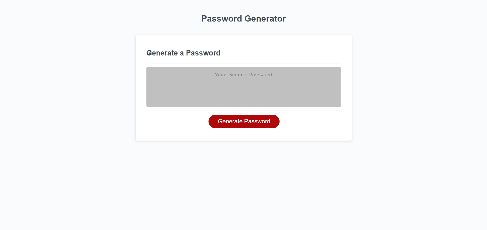

# Password Generator

## Description

This is a basic password generator which requires the user to select how many characters they would like for the password to be (within a range of 8 to 128), using upper and lower case letters, the option to include a number and/or to include a special character. 

## Screenshot

## Link 

[Live URL](https://phoenixpyra7.github.io/password-generator/)

